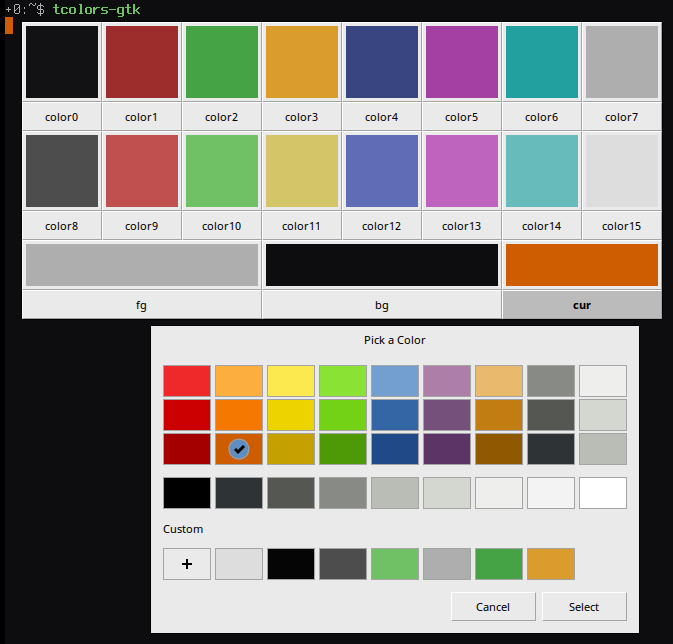
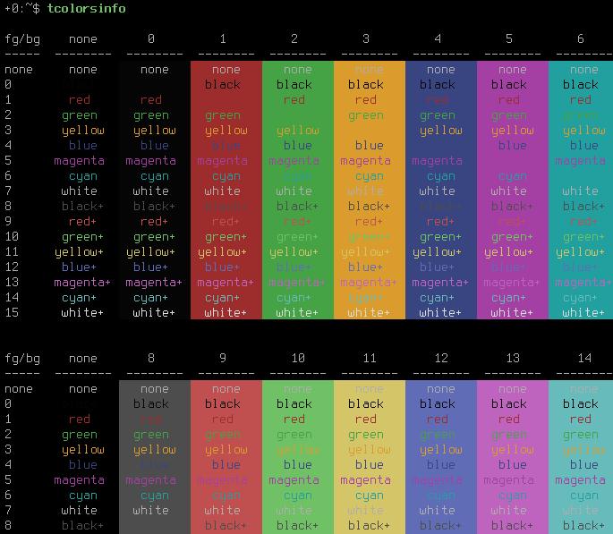

tcolors
=======

:Description: Suite of scripts for dealing with terminal ANSI colors
:License: BSD, see LICENSE for details

Overview:

* ``tcolors`` - get / set terminal ANSI colors (palette, foreground,
  background, cursor)
* ``tcolors-gtk`` - simple GTK interface for ``tcolors``
* ``tcolorsinfo`` - test terminal ANSI colors
* ``tcolorsinfo8`` - ``tcolorsinfo`` wrapper for quick test of base 8 colors

Acknowledgements:

* code for retrieving terminal colors was adopted from
  http://xyne.archlinux.ca/projects/python3-colorsysplus/

tcolors
-------

:Compatibility: Python 2.7 / 3.2

There are 5 modes of operation (see below):

::

    $ tcolors --help
    usage: tcolors [-h] {p,f,b,c,x} ...

    Get/Set terminal ANSI colors.
    Color can be given as name or RGB specification (e.g., #rrggbb).

    positional arguments:
      {p,f,b,c,x}
        p          get/set palette color
        f          get/set foreground color
        b          get/set background color
        c          get/set cursor color
        x          get/set as/from X resources

    optional arguments:
      -h, --help   show this help message and exit

For each mode bring up help by passing ``-h`` or ``--help``, e.g.:

::

    $ tcolors x --help
    usage: tcolors x [-h] [-p] [--prefix PREFIX] [file]

    Get/Set colors as/from X resources.

    positional arguments:
      file             X resources source file; '-' for stdin

    optional arguments:
      -h, --help       show this help message and exit
      -p, --print      don't apply, print-out only
      --prefix PREFIX  X resources prefix (default: *)

Examples:

::

    # get palette color 1
    $ tcolors p 1
    #9d2d2d

    # set palette color 1 to red
    $ tcolors p 1 red

    # set foreground color to gray90
    $ tcolors f gray90

    # set background color to gray10
    $ tcolors b gray10

    # set cursor color to '#FF5500'
    $ tcolors c '#FF5500'

    # get foreground, background, cursor and 0-15 palette colors in X resources format
    $ tcolors x
    *.foreground: #e5e5e5
    *.background: #1a1a1a
    *.cursorColor: #ff5500
    *.color0: #050505
    *.color1: #ff0000
    *.color2: #45a345
    *.color3: #db9c2e
    *.color4: #384580
    *.color5: #a43fa4
    *.color6: #229f9f
    *.color7: #aeaeae
    *.color8: #4d4d4d
    *.color9: #c04f4f
    *.color10: #70c066
    *.color11: #d4c668
    *.color12: #606cb5
    *.color13: #be63be
    *.color14: #68bbbb
    *.color15: #dddddd

    # set colors from X resources
    $ tcolors x ~/.Xresources

    # set colors from X resources targetted for URxvt
    $ tcolors x --prefix 'URxvt*' ~/.Xresources

tcolors-gtk
-----------

:Compatibility: Python 2.7 / 3.2

::

    $ tcolors-gtk --help
    usage: tcolors-gtk [-h] [--prefix PREFIX] [file]

    Set terminal ANSI colors.
    Colors are initialized from terminal itself (if supported).
    If <file> is passed, matching X resources are used instead.

    positional arguments:
      file             X resources source file; '-' for stdin

    optional arguments:
      -h, --help       show this help message and exit
      --prefix PREFIX  X resources prefix (default: *)

tcolorsinfo
-----------

:Compatibility: Python 2.7 / 3.2

::

    $ tcolorsinfo --help
    usage: tcolorsinfo [-h] [-b] [-f] [-s] [-u] [-l] [-r] [-t]
                       [fg_range] [bg_range]

    Performs simple test of terminal ANSI colors.
    Uses following SGR escape sequences:

    * colors 0-7   : CSI 3x/4x m
    * colors 8-15  : CSI 9x/10x m
    * colors 16+   : CSI 38;5;x/48;5;x m

    By default it prints 0-15 foreground on 0-15 background colors split
    in 2 tables. Default foreground and background colors are always included.
    Output can be inverted by using '-t' option.

    If at least one positional argument is specified it will determine
    the output. One can specify foreground and background color ranges as
    2 positional arguments. Format of each range argument is:

    <start_color_index>[,end_color_index,[step]]

    E.g.,

    * 0,64,8        - yields: 0, 8, 16, 24, 32, 40, 48, 56
    * 5,10          - yields: 5, 6, 7, 8, 9
    * 35            - yields: 35, 36, 37, 38, 39, 40, 41, 42

    Examples:

    $ tcolorsinfo 0,16       - 0-15 foreground colors on 0-7 backgrounds
    $ tcolorsinfo 0,16 0,16  - 16x16 color cube

    positional arguments:
      fg_range
      bg_range

    optional arguments:
      -h, --help        show this help message and exit
      -b, --bold        CSI 1 m
      -f, --faint       CSI 2 m
      -s, --standout    CSI 3 m
      -u, --underlined  CSI 4 m
      -l, --blink       CSI 5 m
      -r, --reverse     CSI 7 m
      -t, --transpose

Color Schemes
-------------

X resources are normally preprocessed with preprocessor (e.g., ``cpp``) and
that makes it easy to separate terminal schemes into separate files. I put
color schemes into ``~/.xcolors`` directory and reference the ``default``
one in ``~/.Xresources`` file in the following way::

    ! xcolors --------------------------------------------------------------------
    #include ".xcolors/default"

With the help of ``tcolors`` it's easy to implement simple color scheme
switcher / selector. That's handy for switching between couple of favorite
schemes, or trying out new schemes.

To serve this purpose I've created myself simple bash script called ``tcolors-sel``
(`source <https://github.com/miroslavkoskar/homefiles/blob/master/bin/tcolors-sel>`_).
It is built on top of ``scroller``
(`source <https://github.com/miroslavkoskar/homefiles/blob/master/bin/scroller>`_)
which is separate program providing simple VI like scrolling over its arguments.
